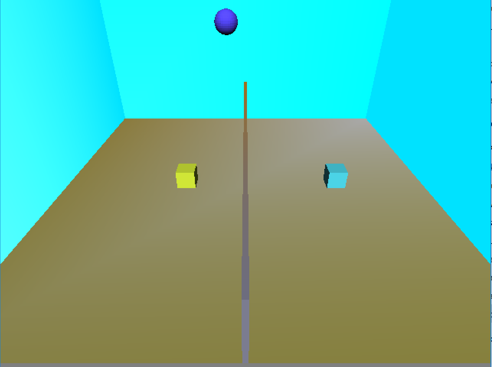

# Cube Volleyball

Cube Volleybay is Sihan Wang's implementation of [Cube Volleybal](http://graphics.cs.cmu.edu/courses/15-466-f17/game3-designs/rmukunda/) for game3 in 15-466-f17.



## Asset Pipeline

The main assets of this game come from the provided blender file. They include a variety of meshes used to implement the game. A python script was used to load the vertex location and vertex color of the meshes into a meshes data structure in OpenGL. For simplicity reasons, instead of avoiding duplicate meshses, the script I used simply copied every single mesh present in the blender file which means walls were duplicated to be each of their own mesh, the same applies to the two player cubes. Essentially the exact same method was used as game2.

## Architecture

Most of the implementation was fairly straight forward. The scene was an unordered map of objects to be rendered. I used very simple lighting for the fragment shader and no material, the faked hemispheric light is toned down from game2 to make the walls less white.  Each object has its own position and rotations which allowed for independent manipulation of the objects in the world. There is no rotation in this game meaning the ball does not rotate when colliding with any object. The collision is rather hard coded than based on some smart collision detection design. This choice was impart because the number objects colliding is fairly minimal and it was convenient to simply the necessary action when those collisions occured while checking those conditions. The values chosen for gravity and movement were fairly arbitrary, I tested them until I thought the values were reasonable. I did have 360% collision for both players. The physics effect on the ball on collision depends on the state of the player, but there is also a base increase in upward z velocity even if the player is not moving. The left and right movement and jumping all changes the physics effect on the ball on collision.

## Reflection

I think it turned out pretty well. I was actually trying to include full 3d movement, until I realized that made the game nearly impossible to play. I think if there was anything I really would change I would work on the actual assets abit more, maybe get a real net and a bit more physics when getting either the net case of out of bounds cases so the ball continues to move for a bit before resetting instead of instantly resetting as it does now. I also really wanted to add a score board, but that turned out to be far more difficult than I expected so I skipped that for now.

The design document was clear in most aspects, the only ambiguity was how to deal with certain out of bounds rules. I generally stuck with known volleyball rules for those scenarios.


# About Base2

This game is based on Base2, starter code for game2 in the 15-466-f17 course. It was developed by Jim McCann, and is released into the public domain.

## Requirements

 - modern C++ compiler
 - glm
 - libSDL2
 - libpng
 - blender (for mesh export script)

On Linux or OSX these requirements should be available from your package manager without too much hassle.

## Building

This code has been set up to be built with [FT jam](https://www.freetype.org/jam/).

### Getting Jam

For more information on Jam, see the [Jam Documentation](https://www.perforce.com/documentation/jam-documentation) page at Perforce, which includes both reference documentation and a getting started guide.

On unixish OSs, Jam is available from your package manager:
```
	brew install ftjam #on OSX
	apt get ftjam #on Debian-ish Linux
```

On Windows, you can get a binary [from sourceforge](https://sourceforge.net/projects/freetype/files/ftjam/2.5.2/ftjam-2.5.2-win32.zip/download),
and put it somewhere in your `%PATH%`.
(Possibly: also set the `JAM_TOOLSET` variable to `VISUALC`.)

### Bulding
Open a terminal (on windows, a Visual Studio Command Prompt), change to this directory, and type:
```
	jam
```

### Building (local libs)

Depending on your OSX, clone 
[kit-libs-linux](https://github.com/ixchow/kit-libs-linux),
[kit-libs-osx](https://github.com/ixchow/kit-libs-osx),
or [kit-libs-win](https://github.com/ixchow/kit-libs-win)
as a subdirectory of the current directory.

The Jamfile sets up library and header search paths such that local libraries will be preferred over system libraries.
